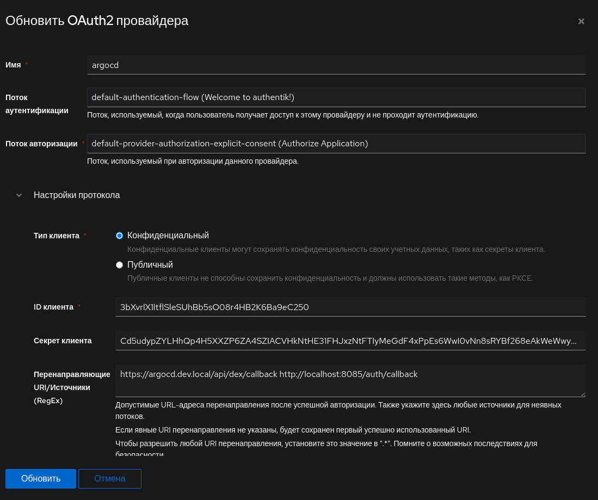
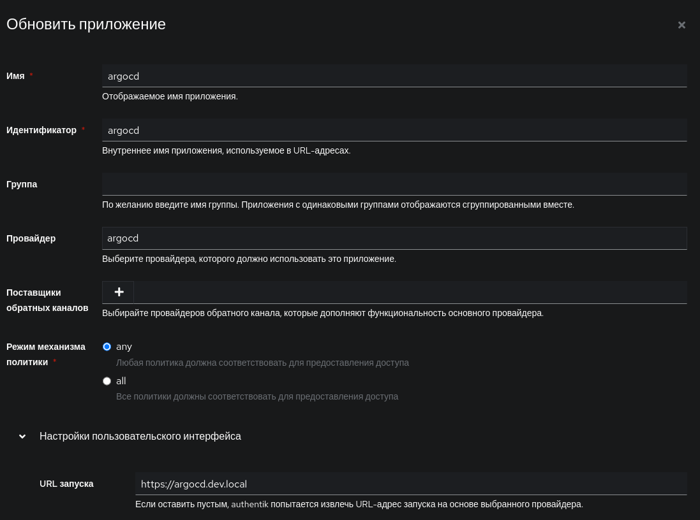

## **Подготовка**

Будут использоваться следующие параметры:

- `argocd.dev.local` FQDN установки ArgoCD.
- `auth.dev.local` FQDN установки authentik.

>[!Note]
> Все доменные имена, должны распозноваться в ДНС системы или k8s

## **Конфигурация authentik**

### Создание провайдера

В authentik создайте **OAuth2/OpenID Provider** (в разделе **Applications/Providers**) с такими настройками:



- **Name**: ArgoCD
- **Client Type**: `Confidential`
- **Signing Key**: Выберите любую доступную кнопку
- **Redirect URIs**:
	```bash
	https://argocd.dev.local/api/dex/callback
	http://localhost:8085/auth/callback
	```
	
После создания провайдера обратите внимание на `Client ID` и `Client Secret`, их нужно будет передать ArgoCD в поле **ArgoCD Configuration**.

###  Создание приложения

Create a new **Application** (under **Applications/Applications**) with these settings:



- **Name**: ArgoCD
- **Provider**: ArgoCD
- **Slug**: argocd
- **Launch URL**: `https://argocd.dev.local/auth/login`

### Создание группы ArgoCD

Создайте новую **группу** (в разделе **Каталог/Группы**), которая будет использоваться в качестве группы администраторов для ArgoCD (если у вас уже есть группа «admin», эту часть можно пропустить).

- **Name**: ArgoCD Admins
- **Members**: Добавьте своего пользователя и/или любого пользователя, который должен быть администратором ArgoCD

При желании можно создать еще одну группу для доступа к ArgoCD только для чтения:

- **Name**: ArgoCD Viewers
- **Members**: Любой пользователь, который должен иметь доступ к ArgoCD только для чтения

## **Конфигурация ArgoCD**

>[!Note:]
>Мы будем использовать не конфигурацию oidc, а «dex», поскольку oidc не позволяет использовать ArgoCD CLI, а DEX позволяет.

### Добавить секрет OIDC в ArgoCD

Создайте секрет base64:

```bash
echo -n "Client secret" | base64
```

В поле `argocd-secret` Secret добавьте следующее значение в поле `data`:

```yaml
dex.authentik.clientSecret: <base 64 encoded value of the Client Secret>
```

### Настройте ArgoCD на использование authentik в качестве бэкенда OIDC

В конфигурационной карте `argocd-cm` добавьте следующее в поле данных :

```yaml
url: https://argocd.dev.local
dex.config: |
    connectors:
    - config:
        issuer: https://auth.dev.local/application/o/argocd/
        clientID: 3bXvrlX1ltflSleSUhBb5sO08r4HB2K6Ba9eC250
        clientSecret: $dex.authentik.clientSecret
        insecureEnableGroups: true
        scopes:
          - openid
          - profile
          - email
      name: authentik
      type: oidc
      id: authentik

```

### Назначьте группу `ArgoCD Admins` на роль администратора ArgoCD

В ConfigMap `argocd-rbac-cm` добавьте следующее в поле `data` (или создайте его, если его там еще нет) :

```yaml
policy.csv: |
    g, ArgoCD Admins, role:admin
    g, ArgoCD Viewers, role:readonly
```

Если у вас уже была группа «admin», и вы не стали создавать группу `ArgoCD Admins`, просто замените `ArgoCD Admins` на имя существующей группы. Если вы не стали создавать группу только для чтения или решили использовать группу с другим именем в authentik, переименуйте или удалите ее соответствующим образом.

Примените все измененные манифесты, и вы сможете войти в ArgoCD как через пользовательский интерфейс, так и через CLI.