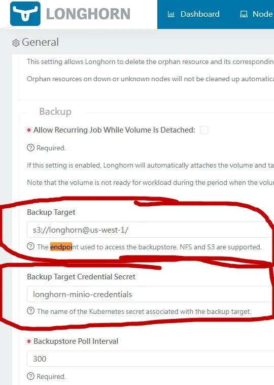

## 1. Install minio
```bash
helm install longhorn longhorn/longhorn -f longhorn.yaml -n longhorn-system --create-namespace
```

## 2. Add node labels
```bash
k annotate nodes node01 node02 node03 node.longhorn.io/default-node-tags='["data","db"]'
```

## 3. Add disk to node
```bash
k label nodes node01 node02 node03 node.longhorn.io/create-default-disk='config'
```
```bash
k annotate nodes node01 node.longhorn.io/default-disks-config='[{"name":"data","path":"/mnt/data","allowScheduling":true,"tags":["hdd"]}]'
```
```bash
k annotate nodes node02 node03  node.longhorn.io/default-disks-config='[{"name":"data","path":"/mnt/data","allowScheduling":true,"tags":["hdd"]},{"name":"db","path":"/mnt/db","allowScheduling":true,"tags":["ssd"]}]'
```

## 3. Create secret for minio backup

```bash
export AWS_ACCESS_KEY_ID="<your-aws-access-key-id>"
export AWS_SECRET_ACCESS_KEY="<your-aws-secret-access-key>"
export AWS_ENDPOINT="http://minio.minio.svc.cluster.local:9000"
```

```bash
kubectl create secret generic minio-credentials \
    --from-literal=AWS_ACCESS_KEY_ID=${AWS_ACCESS_KEY_ID} \
    --from-literal=AWS_SECRET_ACCESS_KEY=${AWS_SECRET_ACCESS_KEY} \
    --from-literal=AWS_ENDPOINTS=${AWS_ENDPOINT} \
    -n longhorn-system
```
## 4. update longhorn

If we use helm, you need add this string to `values.yaml`

```yaml
defaultBackupStore:
  backupTarget: s3://longhorn-backup@us-west-1/
  backupTargetCredentialSecret: minio-credentials
  pollInterval: 300
```

If you use UI  go to **settings** - **Backup target**



