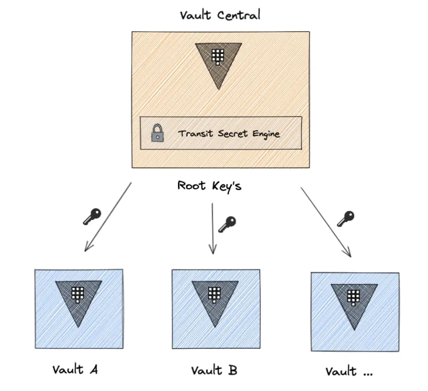

 ## Настройка Vault в Docker с помощью Docker Compose

Для настройки vault autounseal trasit engine нужны 2 установки vault

Мы будем использовать Docker для запуска Vault в Docker и настроем на нем transit token, а затем настроим Vault в Kubernetes для автоматического распечатывания через vault в докере.



1. Создайте файл `docker-compose.yml` для запуска Vault:

```yaml
services:
  vault:
    container_name: vault
    image: hashicorp/vault
    restart: always
    environment:
      - VAULT_ADDR=http://0.0.0.0:8200
      - VAULT_API_ADDR=http://0.0.0.0:8200
      - VAULT_ADDRESS=http://0.0.0.0:8200
    volumes:
      - ./vault.json:/vault/config/vault.json
      - vault-data:/vault/file:rw
      - ./vault/policies:/vault/policies
    ports:
      - 8200:8200
    cap_add:
      - IPC_LOCK
    command: vault server -config=/vault/config/vault.json
volumes:
  vault-data:
```

2. Создайте файл конфигурации `vault.json`

```json
{
  "listener":  {
    "tcp":  {
      "address":  "0.0.0.0:8200",
      "tls_disable":  "true"
    }
  },
  "storage": {
    "file": {
      "path": "/vault/file"
    }
  },
  "default_lease_ttl": "168h",
  "max_lease_ttl": "720h",
  "api_addr": "http://0.0.0.0:8200",
  "ui" : "true"
}
```

3. Запустите Vault с помощью Docker Compose:

```bash
docker compose up -d --build
```

4. Подключитесь к Vault и выполните инициализацию:

```bash
export VAULT_ADDR=http://127.0.0.1:8200
vault operator init
```

Сохраните unseal keys и root token — они понадобятся для управления Vault.

5. Включите Transit Secret Engine:

```bash
vault secrets enable transit
```

6. Создайте ключ `unseal-key`, который будет использоваться для распечатывания HA Vault:

```bash
vault write -f transit/keys/autounseal
```

7. Создайте политику, которая разрешает только операции шифрования/дешифрования:

```bash
vault policy write autounseal -<<EOF
path "transit/encrypt/autounseal" {
   capabilities = [ "update" ]
}

path "transit/decrypt/autounseal" {
   capabilities = [ "update" ]
}
EOF
```

8. Создайте токен с ограниченными правами для использования Transit Secret Engine:

```bash
vault token create -orphan -policy="autounseal" \
   -wrap-ttl=120 -period=24h \
   -field=wrapping_token > wrapping-token.txt
```

Сохраните этот токен — он понадобится для настройки HA Vault в Kubernetes.

9. Выполните следующую команду, чтобы развернуть секреты, переданные из Vault 

```bash
vault unwrap -field=token $(cat wrapping-token.txt)

hvs.CAESIErEuLhua677_F9Uma0cZ30bpWn1-WafzoQmTGRDxKyaGh4KHGh2cy5VenI2RGw4cHJBVElTUm9MNUYwaUhUNlY
```


## Миграция с механизма Shamir на Transit

1. Создадим секрет с токеном который создали в предыдущем этапе

```bash
kubectl create secret generic -n vault vault-auto-unseal-secret --from-literal "VAULT_AUTO_UNSEAL_TOKEN=hvs.CAESIErEuLhua677_F9Uma0cZ30bpWn1-WafzoQmTGRDxKyaGh4KHGh2cy5VenI2RGw4cHJBVElTUm9MNUYwaUhUNlY"
```

2. Отредактируем helm `values.yaml`

Добавим настройку  переменных окружения, которые будут использоваться для подключения к внешнему Vault и конфигурацию для использования механизма шифрования/дешифрования через Transit Secret Engine

```yaml
server:
  extraSecretEnvironmentVars:
  - envName: VAULT_TOKEN
    secretName: vault-auto-unseal-secret
    secretKey: VAULT_AUTO_UNSEAL_TOKEN
  ha:
    enabled: true
    raft:
      config: |
        ---
        seal "transit" {
          address = "http://192.168.59.1:8200"
          disable_renewal = "false"
          key_name = "autounseal"
          mount_path = "transit/"
          tls_skip_verify = "true"
        }
        ---
```

3. Установим или обновим чарт 

Есть подготовленный `vault-tls-ha-autounseal.yaml`

```bash
helm upgrade --install vault hashicorp/vault -f vault-tls-ha-autounseal.yaml -n vault
```

Проверим статус vault командой:

```bash
kubectl exec -n vault vault-1 -- vault status
```

В нашем случае вывод следующий:

```bash
Key                           Value
---                           -----
Seal Type                     transit
Recovery Seal Type            shamir
Initialized                   true
Sealed                        true
Total Recovery Shares         1
Threshold                     1
Unseal Progress               0/1
Unseal Nonce                  n/a
Seal Migration in Progress    true
Version                       1.18.1
Build Date                    2024-10-29T14:21:31Z
Storage Type                  raft
HA Enabled                    true
```

Исходя из текущего состояния Vault, мы находимся в процессе миграции с Shamir Seal на Transit Seal. Чтобы завершить этот процесс, выполните следующие шаги:


```bash
kubectl exec -n vault vault-0 -- vault operator unseal --migrate $VAULT_UNSEAL_KEY
kubectl exec -n vault vault-1 -- vault operator unseal --migrate $VAULT_UNSEAL_KEY
kubectl exec -n vault vault-2 -- vault operator unseal --migrate $VAULT_UNSEAL_KEY
```

После выполнения миграции проверим:

```bash
kubectl exec -n vault vault-0 -- vault status 
```

Как видим все успешно мигрировало и хранилище распечатано

```bash
Key                      Value
---                      -----
Seal Type                transit
Recovery Seal Type       shamir
Initialized              true
Sealed                   false
Total Recovery Shares    1
Threshold                1
Version                  1.18.1
Build Date               2024-10-29T14:21:31Z
Storage Type             raft
Cluster Name             vault
Cluster ID               08ab7795-ae46-6c4b-fc65-e1bb0db8c76a
HA Enabled               true
HA Cluster               https://vault-0.vault-internal:8201
HA Mode                  standby
Active Node Address      https://10.244.104.5:8200
Raft Committed Index     107
Raft Applied Index       107
```

